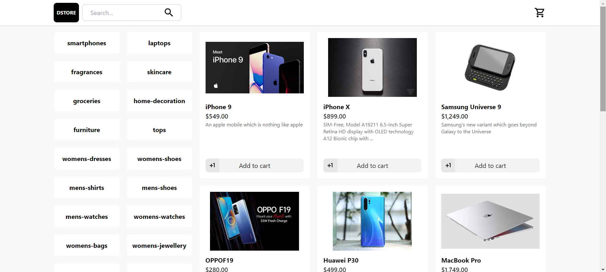
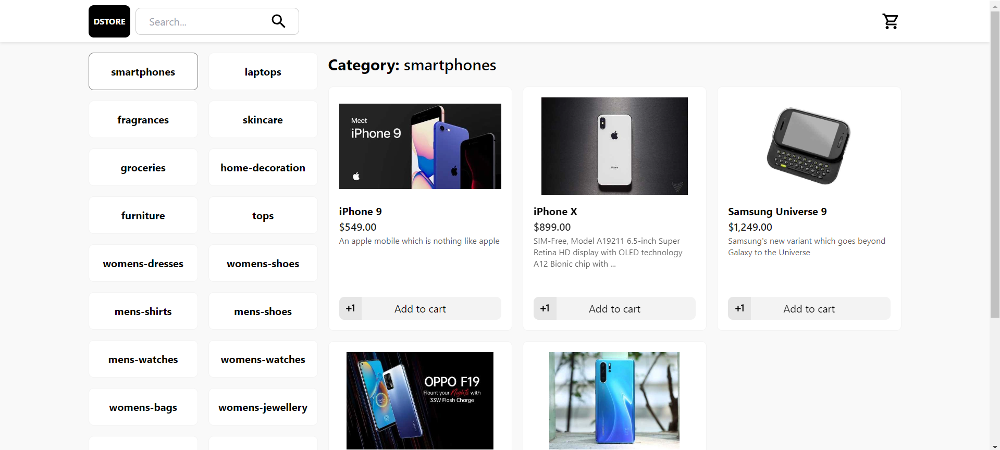
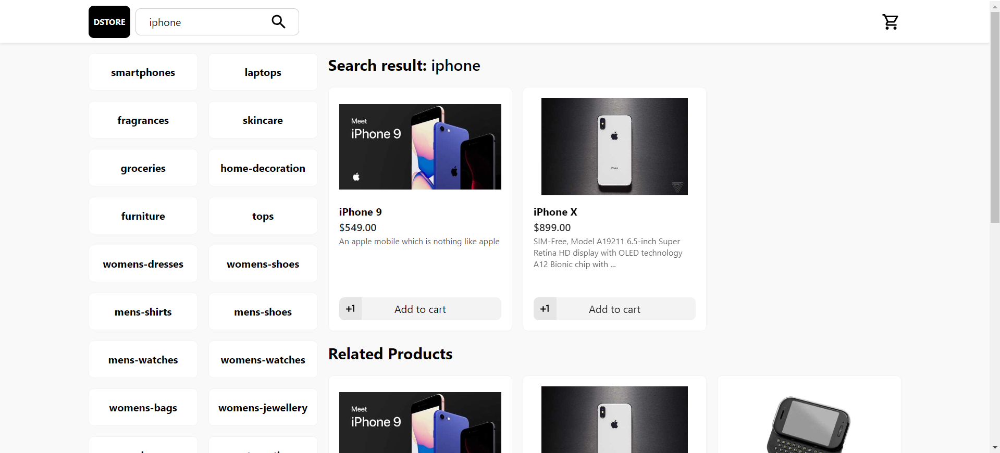
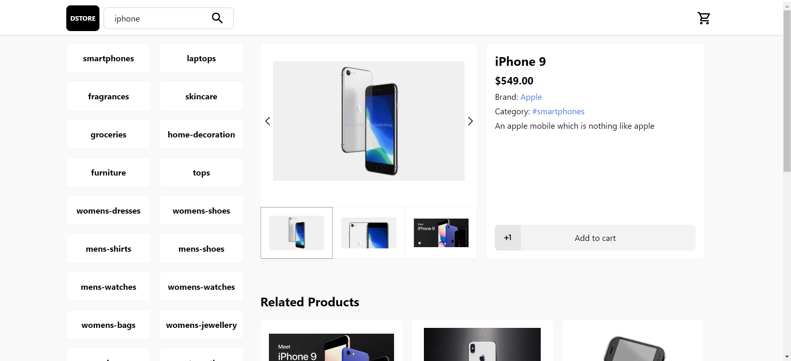

# D-Store SSR Template

This is a prototype E-commerce SSR template using Next.js

## Technology Stack and Features

- [React](https://react.dev) for the frontend component.
  - Using TypeScript, hooks, and other parts of a modern frontend stack.
- [Next.js](https://nextjs.org) for the React framework.
- [DummyJSON](https://dummyjson.com) for the fake JSON data.

## Review

### Homepage

### Category page

### Search page

### Product/[id]

## How to use it

You can just **fork or clone** this repository and use it as is.

## License

The D-Store SSR template is licensed under the terms of the [MIT license](/LICENSE).
